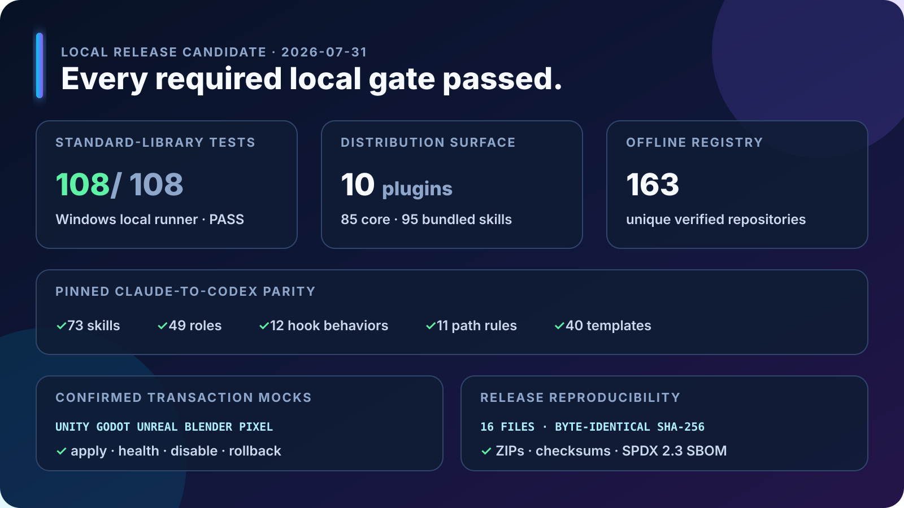
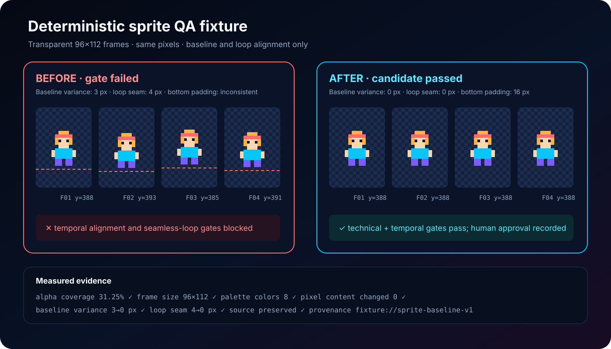

# Validation and before/after examples

## Local release-candidate validation



The dashboard is generated from the reproducible commands and evidence recorded in [VALIDATION.md](VALIDATION.md). Hosted Windows, macOS, and Linux links remain pending until the public repository workflows run.

The release includes synthetic, rights-cleared fixtures so validation behavior is inspectable without downloading a model, engine, editor, or proprietary asset.

## Sprite baseline and loop correction



The candidate changes frame placement only: pixel content, palette, dimensions, and alpha remain fixed. Baseline variance improves from 3 px to 0 px and the loop seam from 4 px to 0 px. The source is preserved and fixture approval is explicit.

Machine-readable evidence: [`representative-quality-evidence.json`](assets/representative-quality-evidence.json)

## Other representative gates

| Fixture | Evidence checked |
|---|---|
| Real-time mesh | Triangle budget, manifold topology, normals, UV overlap, LODs, collision |
| Rig and locomotion | Unweighted vertices, foot slide, loop error, root-motion continuity |
| Ambience loop | True peak, loudness, loop seam, clipped samples |
| Greybox scene | Spawn-to-goal reachability, navigation, p95 frame time, memory, draw calls |
| Visual regression | Different-pixel percentage, SSIM, camera drift, human review |
| Gameplay smoke | Launch, core action, win/loss feedback, restart, crashes |

Run the evidence tests:

```text
python -m unittest tests.test_quality_fixtures -v
```

These fixtures prove the validators and evidence contract, not the output quality of any external model. Production assets must generate their own artifacts under the same gates.
