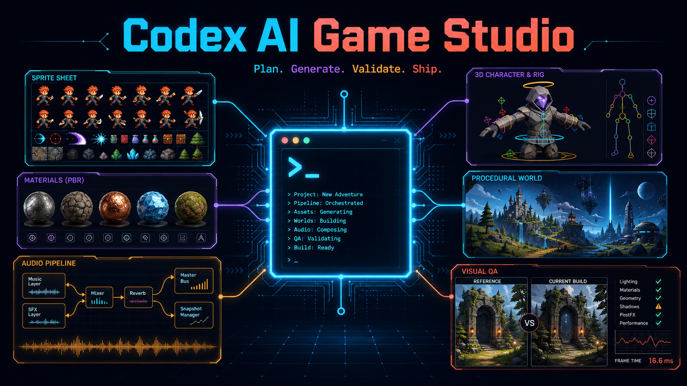

# Codex AI Game Studio



**85 skills · 49 roles · 163 verified repositories · five editor MCP packs · Windows, macOS, and Linux**

Codex AI Game Studio is a local-first game-production plugin. It combines studio planning, generative assets, engine routing, visual/playability QA, and reversible setup. The core has no hosted backend.

## Install

```text
codex plugin marketplace add frabcd/codex-ai-game-studio --ref main
codex plugin add ai-game-studio@frabcd-ai-game-studio
```

Start a new task and invoke:

```text
$ai-game-studio:start Inspect this project read-only and propose the safest next playable milestone.
```

## Documentation

- [Tutorial workbook](TUTORIALS.md)
- [Architecture](ARCHITECTURE.md)
- [Validation and before/after examples](EXAMPLES.md)
- [Catalog contribution guide](CATALOG_CONTRIBUTING.md)
- [Claude migration](CLAUDE_MIGRATION.md)
- [Troubleshooting](TROUBLESHOOTING.md)
- [Upgrade guide](UPGRADING.md)
- [Roadmap](ROADMAP.md)
- [Privacy](privacy/)
- [Terms](terms/)
- [Support](support/)

The source, issues, Discussions, releases, checksums, and security policy live at [github.com/frabcd/codex-ai-game-studio](https://github.com/frabcd/codex-ai-game-studio).
